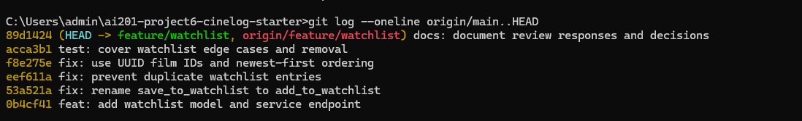

# PR Response Doc — CineLog Watchlist Feature

## AI Usage

I used AI for repository orientation and review hygiene. I asked it to compare the watchlist service with `add_to_collection()`, identify all `save_to_watchlist` call sites, and stress-test the two design decisions. For Comment 4, the counterargument it raised was that a public default can expose viewing interests; I kept the public default because CineLog is community-oriented, but made the `public` parameter explicit and added that privacy tradeoff to my response. For Comment 5, it challenged whether alphabetical order is easier for title lookup; I kept newest-first because watchlists are primarily queues of recent intent and CineLog already uses newest-first for collections. I verified every code-related suggestion against the source and test suite.

## Comment 1 — Rename

**What I did:** Renamed `save_to_watchlist()` to `add_to_watchlist()` and updated the import and call in `routes/watchlist/watchlist.py`. I used a project-wide search for `save_to_watchlist` to confirm no stale references remained.

**How I verified:** The full test suite imports the renamed function successfully, and the old name no longer appears anywhere in the project.

## Comment 2 — Deduplication

**What I did:** Added an `AlreadyInWatchlistError` and queried for an existing `(user_id, film_id)` pair before inserting. This follows `add_to_collection()` rather than relying only on a database error. I also added a matching unique constraint as a final defense against duplicates.

**How I verified:** `test_add_to_watchlist_duplicate_raises` adds the same film twice, expects the domain-specific exception, and confirms that only one row exists.

## Comment 3 — Missing test

**What I did:** Created `tests/test_watchlist.py` using the isolated in-memory database fixtures from `tests/test_collection.py`. The requested test passes an all-zero UUID that is not present and expects `FilmNotFoundError`.

**How I verified:** `test_add_to_watchlist_nonexistent_film_raises` passes, along with the full suite.

## Comment 4 — Default visibility

**My position:** Keep `public=True` for this iteration, but allow callers to explicitly send `public: false` to the add endpoint.

**Reasoning:** CineLog is a community film-tracking app, so shareable discovery is part of the product rather than an unrelated side effect. Keeping the existing public default also avoids changing behavior for clients already built around this PR. The endpoint now passes an explicit visibility choice into the service, so privacy-aware clients are not forced to accept that default.

**Tradeoff acknowledged:** A public default can reveal viewing interests a user expected to keep private. A privacy-first product should default to private, and a future product-wide policy may require that change. Until CineLog defines that policy, exposing the option at creation time makes the current behavior intentional and controllable instead of accidental.

## Comment 5 — Sort order

**My position:** I adopted newest-first date-added ordering.

**Reasoning:** A watchlist is primarily a queue of recent intent. Users are more likely to return looking for a film they just saved than to scan a large list alphabetically. Newest-first also matches `get_collection()`, which makes list behavior consistent across CineLog.

**Engagement with reviewer's point:** The reviewer is right that recency better supports the common return-to-recently-saved workflow. Alphabetical order helps when a user already knows a title, but that is better served by search or an optional sort mode than by making it the only default.

## Comment 6 — Rebase

**What conflicted:** The feature branch was based on integer film IDs while `main` had migrated `Film.id` and `CollectionEntry.film_id` to UUID strings. After replaying the feature commits, verification also exposed that the watchlist model was absent even though the service imported it, so the integration was incomplete.

**How I resolved it:** Rebased `feature/watchlist` onto `origin/main`, defined `WatchlistEntry.film_id` as `String(36)`, updated UUID documentation and request examples, and restored the model relationships needed by `get_watchlist()`.

**How I verified no conflict remains:** I searched the watchlist code for stale integer-ID references, ran all tests, and checked `git log --merges origin/main..HEAD` to ensure the feature history contains no merge commits.

## Stretch Features

I added two focused safeguards beyond the requested missing-film test: duplicate insertion coverage and newest-first ordering coverage. I chose them because those are the two behaviors most likely to regress during service or query changes. I also added the visibility toggle requested in the stretch goals: `POST /watchlist/<user_id>/add` accepts an optional `public` boolean, with a test proving `false` is preserved.

I also added `remove_from_watchlist(user_id, film_id)`, mirroring the existing collection removal pattern. It deletes an existing entry and raises `NotInWatchlistError` when there is nothing to remove; dedicated tests cover both outcomes.

## Rewritten Commit History

The feature branch contains five logical code and test commits plus this documentation commit, all using conventional commit format and with no feature-branch merge commits:

## PR Description

### Overview

Adds watchlist storage, service functions, and REST endpoints for saving and viewing films a user wants to watch. The implementation uses UUID film IDs, rejects duplicate entries with a domain-specific error, and returns watchlists newest-first.

### Design decisions

- Visibility remains public by default for current compatibility and community discovery, while callers can explicitly create private entries.
- Watchlists sort by `date_added` descending to prioritize recent intent and match collection ordering.
- Both an application-level duplicate check and a database unique constraint protect the `(user_id, film_id)` invariant.

### Manual testing

1. Install dependencies with `pip install -r requirements.txt`.
2. Run `pytest tests/ -v`.
3. Start the API with `python app.py`.
4. POST JSON such as `{"film_id": "<film-uuid>", "public": false}` to `/watchlist/<user-uuid>/add`.
5. GET `/watchlist/<user-uuid>` and confirm the saved entry is returned with its visibility and newest entries appear first.
